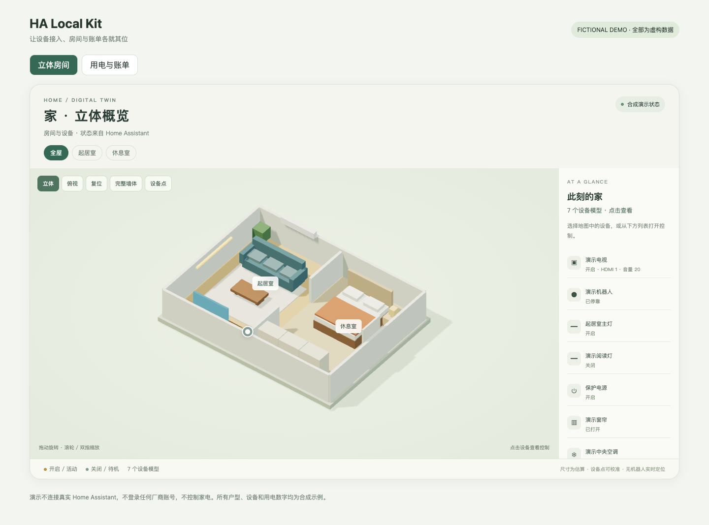
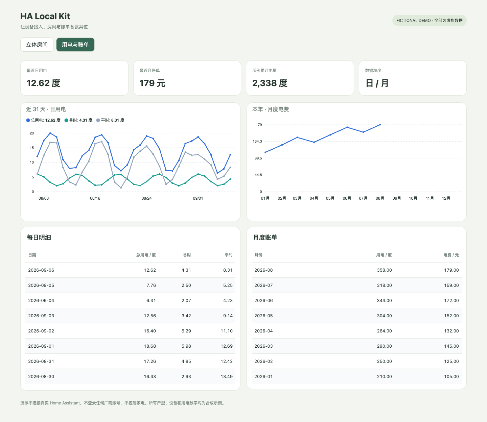

# HA Local Kit

[](https://github.com/clarkzhao/ha-local-kit/actions/workflows/ci.yml)

**把 Home Assistant 的本地接入经验，变成可复用的房间、3D 与电费看板。**

Local-first tools for Home Assistant: room dashboards, an interactive 3D card,
SGCC electricity collection with honest daily/monthly timelines, and device connection helpers.



> 图片、户型、实体 ID 和演示用电数字全部为合成示例。项目不包含真实住宅模型、设备地图、账号、会话或私有部署记录。公开的是代码，不是家庭 HA 服务。

## 能带走什么

- **国网账单看板**：人工登录后复用会话；每日用电、月度账单、分时明细；点击指标进入按日或按月的详情。采集失败保留旧值并标记状态，不伪造小时用电。
- **房间看板生成器**：显式配置房间和实体，生成 HA 原生 Sections；允许给照明设置快捷开关，保护常供电设备。
- **3D 自定义卡片**：Three.js / GLB，房间筛选、模型拾取、灯光／窗帘／电视状态以及 HA 原生设备详情。相机和几何资源随卡片释放。
- **固定 TCP 转发**：一个进程维护多条 loopback 转发，用于已确认宿主可达、HA 虚拟机不可达的情况。
- **设备辅助贡献**：LifeSmart VRF／启动阻塞补丁与隔离回归用例、云鲸中国区身份接入向导和只读不可用诊断、LG webOS 网络配置经验。
- **Agent CLI**：HA REST 的受限命令入口、dry-run、独立令牌文件、拒绝带令牌重定向；不会因为网络错误自动重试设备动作。



## 项目定位与成熟度

这是从一套实际运行的 HA 家庭部署中抽取的 **0.1 实验版工具箱**，不是新的厂商协议驱动、HACS 一键整合包或完整 HA 发行版。

- Python 核心与房间／电费配置生成有自动化测试；前端可在干净目录构建虚构场景。
- SGCC 会话采集在 macOS、Chrome、中国上海账号上验证。网站内部字段不是稳定官方接口；其他省份和多户号未验证。采集运行器使用 POSIX 锁与超时，支持 macOS/Linux，尚不支持 Windows 原生运行采集。
- LifeSmart 兼容补丁面向固定上游版本；云鲸账号辅助属于实验性入口；LG 使用 HA 原生 webOS 集成。
- 家庭原实例经历过实机验证，不代表公开示例中的每个硬件动作、固件与安装平台都已验证。详见 [兼容性与来源](docs/compatibility.md)。

## 快速开始

Python 3.13+；只生成房间看板或运行 TCP 转发时不需要浏览器依赖。

```bash
git clone https://github.com/clarkzhao/ha-local-kit.git
cd ha-local-kit
python3 -m venv .venv
source .venv/bin/activate
python -m pip install -e .

# JSON 也是有效 YAML；先生成文件，核对实体后再放入 HA。
ha-local-kit-rooms examples/rooms.json > rooms.yaml
ha-local-kit-electricity --dashboard-path electricity-board > electricity.yaml
```

Windows 激活命令为 `.venv\Scripts\Activate.ps1`；CLI 输出中文时建议设置 `PYTHONUTF8=1`。示例实体须替换为你自己的 HA 实体，命令不会替你修改注册表、控制家电或重启 HA。

- [房间、国网与 3D 接入步骤](docs/setup.md)
- [3D 模型格式和 Blender 工作流](docs/3d.md)
- [Module 设计与维护边界](docs/architecture.md)
- [公开代码与私有部署的隔离规则](CONTRIBUTING.md#公开仓库与私有部署)
- [云鲸身份确认、HA 配置与不可用诊断](extras/narwal/README.md)
- [LifeSmart VRF 与本地连接启动修复](extras/lifesmart/README.md)

## 本地演示

Node.js 22+，演示既不读取 HA token，也不连接家电。

```bash
cd frontend
npm ci
npm run build
npm run demo:assets
cd ..
python -m ha_local_kit.sgcc.dashboard > frontend/dist/electricity.json
python -m http.server 8090 --bind 127.0.0.1 --directory frontend/dist
```

打开 `http://127.0.0.1:8090`，可切换立体房间与合成电费看板。图表资源固定版本并校验 SHA-256；Three.js 与卡片都由本地服务器提供。可以把演示发布为静态页面，但不要把自己的布局、绑定或登录文件放进公开目录。

## 验证与贡献

```bash
python -m pip install -e '.[dev]'
python -m unittest discover -s tests -v
python scripts/check-public-tree.py
cd frontend && npm ci && npm run build
```

CI 在 Linux / Windows 执行 Python 测试并构建前端。浏览器组件渲染检查属于独立演示验证，不冒充登录后的 HA 全流程测试；硬件回归不会在 CI 中运行。

欢迎提交新的省份字段样本、固件能力记录、脱敏回归用例和看板改进。请先阅读 [CONTRIBUTING](CONTRIBUTING.md)，不要提交账号、验证码、Device ID、完整户号、原始地图或登录响应。

## 授权与致谢

核心 Python、房间和 3D 展示代码采用 **MIT**。`extras/lifesmart/` 包含针对 GPL 上游的片段与补丁，单独采用 **GPL-3.0**，不属于 MIT Python 包。第三方图表、Three.js 和厂商集成保留各自许可证，见 [THIRD_PARTY_NOTICES](THIRD_PARTY_NOTICES.md)。

特别感谢 MapleEve/lifesmart-for-homeassistant、sjmotew/NarwalIntegration、rudyll/narwal_r、ARC-MX/sgcc_electricity_new、Home Assistant、ApexCharts Card 和 Flex Table Card。我们贡献的是衔接代码、看板、兼容性修复和可复现经验，不把上游协议实现归为自己的原创成果。
