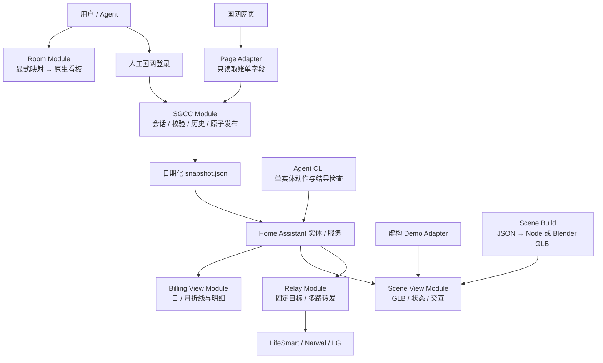

# Module 设计

设计原则来自 `codebase-design`：小 Interface 隐藏实际复杂性；只在已有两种不同使用方式处设置 Seam，避免先造一个通用插件框架。

## 选择的 Interface

- **Room**：`build(config) -> dashboard`。输入明确列出区域与实体，不根据家庭设备编号猜测房间；输出不直接写入 HA。新增品牌不改变该模块。
- **SGCC**：一次采集命令接收 `state-dir`、`ha-dir` 与浏览器入口，输出带成功时间、源数据日期和状态的快照。账号验证、锁、超时、失败保留、SQLite 去重和文件权限集中维护。
- **Billing View**：结构化快照 → 日/月视图。时间轴代表用电日与账单月，采集时间只作更新时间；不给账单传感器虚假的实时统计属性。
- **Relay**：`relays.json` → 一个生命周期内的固定 loopback 监听集合。它不做网段扫描、协议解析、目标自动选择或系统路由修改。
- **Scene Build**：同一 `scene.json` 可走 Node 快速构建，或 Blender 生成可编辑源文件。两种 Adapter 共享米制坐标、实体绑定和 GLB extras。
- **Scene View**：`setConfig(...)` 与 `hass` 状态入口。HA Adapter 提供真实状态和服务，Demo Adapter 提供合成状态。当前仍是一个自定义卡片类，未假称已抽象成独立跨框架渲染引擎。
- **Agent**：单实体读写命令。HA 负责协议与权限；CLI 负责明确目标、dry-run、令牌输入和不确定结果处理。

## 为什么不按品牌各造一套看板

房间、时间轴和 3D 绑定只关心 HA 的实体与服务。LifeSmart、云鲸和 LG 的协议差异已由现有集成处理。将这些差异放进看板会导致配置重复、状态滞后和能力判断失真。

国网是例外：它交付的是延迟账单与日用电，不能当作实时传感器历史。该区别保留在 SGCC 与 Billing View 的 Interface 中；后续若增加其他电力来源，应先找出真实不同的 Adapter，再抽象共享契约。

## 当前目录

`ha_local_kit/` 是可安装核心；`frontend/` 是可独立构建的卡片与虚构演示；`examples/` 只含人工构造的映射；`extras/` 保留实验性账号工具和单独授权的上游兼容补丁。没有自动修改 HA `.storage` 的公开安装脚本。

## 下一步

先补省份字段夹具、布局校验与可访问性，再考虑可视化编辑器、HACS 打包和上游 PR。Energy 长期统计回填应独立设计并验证去重、修订和跨年行为，不能通过简单增加 `state_class` 冒充已经完成。
