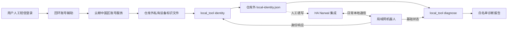

# 云鲸中国区接入与只读诊断（实验性）

工具覆盖三个步骤：人工账号登录获取完整 Device ID、本地确认 product_key、解释状态快照中的不可用线索。日常控制仍由 [sjmotew/NarwalIntegration](https://github.com/sjmotew/NarwalIntegration) 提供，本目录不复制协议驱动。

先前实机证据来自逍遥 001、固件 `v01.08.10.05` 与上游提交 `4e5884066895ee2ed29b81a6aba107fd32590982`（manifest 1.0.8）。该记录覆盖身份、状态和地图读取；未逐项验证完整清扫／回充／洗烘动作。新的通用工具有合成客户端测试，不等于再次完成所有实机验收。



## 1. 人工获取完整 Device ID

Python 3.13+。在仓库之外准备只属于当前用户的目录，例如 `$HOME/.config/ha-local-kit/narwal`；Windows PowerShell 中可使用 `$env:USERPROFILE` 构造路径。下面命令使用 macOS/Linux shell 语法。

```bash
python extras/narwal/account_helper.py \
  --state-dir "$HOME/.config/ha-local-kit/narwal"
```

打开 `http://127.0.0.1:8766`，用已有中国区账号手机号和短信验证码人工登录。需要图形或额外验证时按官方流程处理，不绕过。工具只查询设备，不执行清扫；云端接口来自 App/H5 行为研究，可能变化。

成功后，`device-identifiers.json` 中的 `devices[]` 是设备列表。私下核对目标设备名称，记下其从 **1** 开始的序号。辅助工具不会把手机号、验证码或云端令牌写入标识文件，查询成功后清除内存令牌；用完后结束辅助进程。不要公开该文件或界面截图。

完整 Device ID 不能用序列号、mDNS 名称后缀或 `iotId` 代替；云端 `productId` 也不能当作 `product_key`。详见[上游身份说明](https://github.com/sjmotew/NarwalIntegration#finding-the-device-id)。

## 2. 在独立环境准备上游客户端

使用仓库外的上游固定版本副本。不要加载来源不明的 Python 文件。

```bash
git clone https://github.com/sjmotew/NarwalIntegration.git /path/to/NarwalIntegration
git -C /path/to/NarwalIntegration checkout 4e5884066895ee2ed29b81a6aba107fd32590982
python -m venv /path/to/narwal-tools-venv
source /path/to/narwal-tools-venv/bin/activate
python -m pip install 'websockets>=15,<17' 'bbpb>=1.4,<2' 'Pillow>=9,<13'
```

`--component` 指向包含 `narwal_client/` 的目录，即该副本的 `custom_components/narwal`。本工具直接加载其独立客户端，不需要安装 Home Assistant，也不读取 `.storage`。上游升级时先重新测试；版本范围并不承诺所有未来依赖组合均兼容。

安装依赖后可先执行无设备回归：

```bash
python extras/narwal/client_regression.py /path/to/NarwalIntegration/custom_components/narwal
```

它执行真实客户端的身份与状态解析方法，但网络与命令传输已被 mock，并拒绝预期之外的命令；不发送短信、不连接机器人。

## 3. 本地确认身份

将 `<机器人地址>` 替换为 DHCP 列表或 App 显示的地址。下面 `--device-index 1` 只是示例，必须与你私下核对的列表行对应。

```bash
python extras/narwal/local_tool.py identity \
  --account-file "$HOME/.config/ha-local-kit/narwal/device-identifiers.json" \
  --device-index 1 --host '<机器人地址>' \
  --component /path/to/NarwalIntegration/custom_components/narwal \
  --output "$HOME/.config/ha-local-kit/narwal/local-identity.json"
```

如果账号数据没有 product key，工具调用上游的有限时身份发现，再向机器人确认完整 ID 与 product key。发现可能唤醒本地通信，但不会调用清扫、回充、洗烘或拍照方法。默认 75 秒，最多可配置 120 秒；确认失败或 ID 不匹配时，不写身份文件。若已提供 product key，响应不一致也会拒绝。

输出文件包含连接地址、完整 Device ID、机器人确认的 product key 和广播设置；只能放在公开克隆之外。已有文件拒绝覆盖，POSIX 新文件权限为 `600`；Windows 依赖私有目录的账户 ACL。终端只显示白名单诊断，不输出身份、原始响应或含网络地址的异常日志。

默认 `supports_broadcasts=false` 面向本次不广播的机型；只有确认型号支持时才加 `--broadcasts`。本工具不开启长期广播监听，不承诺自动识别所有机型。

## 4. 在 HA 配置集成

通过 HACS 按上游说明安装集成，再在 **设置 → 设备与服务 → 添加集成 → Narwal** 中填写地址及所选型号需要的标识。`local-identity.json` 是人工填写参考，不是 `configuration.yaml`，也不要直接追加进 HA `.storage`。

如果宿主能连接而 HA 容器失败，先检查容器网络、客户端隔离和源地址限制；可使用本库固定 TCP 转发功能，见 [部署步骤](../../docs/setup.md)。转发地址与端口是 HA 的连接入口，身份仍属于机器人，不能替换。上游也记录了[跨 VLAN 源地址限制](https://github.com/sjmotew/NarwalIntegration#if-home-assistant-and-the-robot-are-on-different-vlans)。

首次身份准备需要云账号；HA 日常本地链路不依赖本辅助工具的云端令牌。机器人自身与官方云的连接不由本工具管理。

## 5. 解释“为什么不可用”

```bash
python extras/narwal/local_tool.py diagnose \
  --identity-file "$HOME/.config/ha-local-kit/narwal/local-identity.json" \
  --component /path/to/NarwalIntegration/custom_components/narwal

# 无硬件、无账号的合成示例：
python extras/narwal/local_tool.py explain examples/narwal-diagnostic.json
```

报告只保留受限的状态枚举、布尔标志与查询结果码，并解释基站任务阻塞、烘干计时缺失、未知任务和查询不被接受等线索。`null` 表示没有可用证据，不等同于 `false`。外部快照中任意额外字段、字符串、地图、名称、IP 和设备身份都不会透传。

**它不重新实现 HA 的控制权限判定。** `ha_permissions_evaluated=false` 表示本工具没有读取 HA coordinator 的长期状态。独立连接的新快照可能缺少计时和任务历史，也可能有模型默认值，因此应结合 HA 自带诊断与官方 App 判断。没有发现阻塞标志不代表按钮应该可用；报告不会解锁按钮或停止正在执行的任务。身份或网络错误只输出固定错误码，不进行设备控制重试。

分享前仍需人工审查输出。对照型号／固件提交最小合成复现，不公开原始账号响应、完整 Device ID、SN 或家庭地图。许可证与来源见 [THIRD_PARTY_NOTICES](../../THIRD_PARTY_NOTICES.md)。
